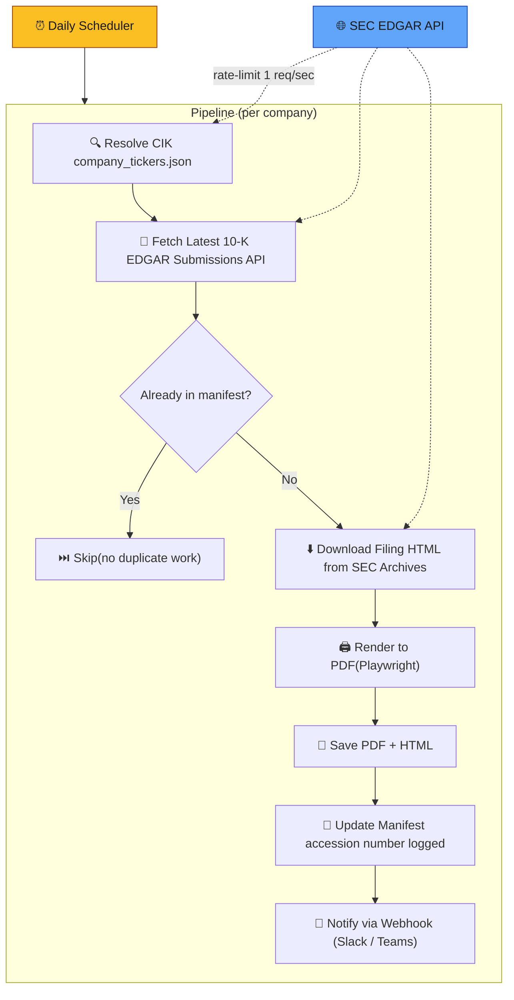
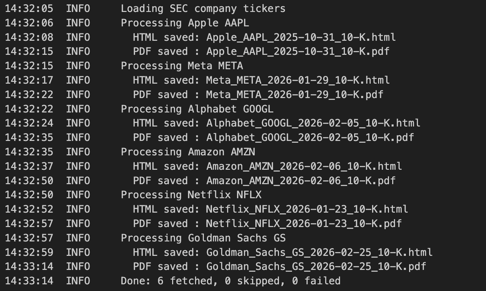
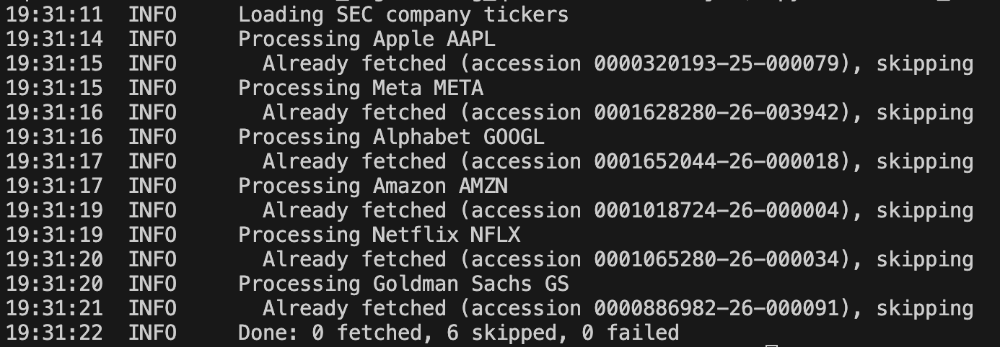

# SEC 10-K Report Fetcher

Creates a reliable, Scalable pipeline that **Extract, Transform** and **Load** latest 10-K annual reports from the SEC EDGAR API for a set of
companies and converts them to PDF.

**Companies:** Apple, Meta, Alphabet, Amazon, Netflix, Goldman Sachs

## Time Spent:

| Category | Time (hrs) |
|----------|---------|
| [THOUGHT_PROCESS.md](THOUGHT_PROCESS.md) | 2 |
| Coding and debugging | 2 |

## Approach

> **Start here → [THOUGHT_PROCESS.md](THOUGHT_PROCESS.md)**
> Covers: problem understanding, SEC API research, architecture decisions, simplification, and what I'd build next.

### Mindmap

> 
> [View the design mindmap on Figma](https://www.figma.com/board/0Vr7GPBXFs2gTlZZIlWQkw/Quartr_Solution_Design?node-id=21-3132&t=hEatoDgM1JnYYkYe-0)

Quartr makes financial data accessible. The 10-K is the most comprehensive public
disclosure a company produces such as revenue breakdowns, risk factors..etc. This
service turns raw SEC filings into a reliable pipeline that feeds downstream products.

## Project Structure

```
sec_fetcher/
├── __init__.py       # Package marker
├── __main__.py       # Entry point (python -m sec_fetcher)
├── cli.py            # CLI orchestration; integrates everything together
├── client.py         # SEC EDGAR API client
├── config.py         # Config files including company info and USER_AGENT
├── manifest.py       # Accession-number tracking
├── models.py         # Filing and FilingResult dataclasses(2 dataclasses)
├── notifier.py       # Webhook notifications
├── pipeline.py       # fetch(EXTRACT) → transform → record(LOAD)
├── renderer.py       # HTML to PDF with Playwright
└── scheduler.py      # Daily scheduling with the scheduler lib.
tests/
└── test_manifest.py  # tests file for deduplications(sample)
```

### Reliability & Scalability

- **Retries with exponential backoff** 4xx/5xx responses: SEC has rate limits (10 req/sec) handles with in code with sleep.
- **Error handling** — checks if all required company info is downloaded and also check when one company info is failed to fetch others will be continued
- **Manifest-based deduplication(JSON)** — a `manifest.json` tracks fetched filings by accession number. Since the file is scheduled it skips if there is no change in filing. In case of amendment it is overwritten but in case of new filing a new version created.
- **Single browser instance** reused across all PDF rendering to avoid repeated startup overhead.
- **Webhook notifications** — optionally POST to a Slack/Teams webhook when a new filing is fetched. This can help with the teams to know when a new filing comes and monitoring if the fetching fails.
- **Daily scheduler** — run continuously with `python -m sec_fetcher.scheduler` and it will fetch once per day.

## Prerequisites

- Python 3.10+

## Setup & Run

```bash
# Create and activate a virtual environment
python3 -m venv quartr
source quartr/bin/activate

# Install dependencies
pip install -r requirements.txt

# Install the Playwright Chromium browser (required once)
playwright install chromium

# Run the fetcher
python -m sec_fetcher
```

### Scheduler

Run the fetcher automatically once per day:

```bash
python -m sec_fetcher.scheduler              # daily at 08:00 (default)
python -m sec_fetcher.scheduler --time 14:30  # daily at 14:30
```

### Docker

```bash
# Build the image
docker build -t sec-fetcher .

# Run the fetcher (outputs saved under sec_10k_pdfs on the host)
docker run --rm -v "$(pwd)/sec_10k_pdfs:/app/sec_10k_pdfs" sec-fetcher

# Run the scheduler inside the container
docker run --rm -v "$(pwd)/sec_10k_pdfs:/app/sec_10k_pdfs" sec-fetcher python -m sec_fetcher.scheduler
```

## Configuration

Edit `sec_fetcher/config.py`:

| Constant | Purpose |
|----------|---------|
| `USER_AGENT` | SEC requires a USER_AGENT in the format real name + email; else the API fails |
| `COMPANIES` | This is the company names that we need information from SEC; Can add or remove based on what we need |
| `REQUEST_DELAY_SECONDS` |As SEC has rate limiting; Delay between SEC requests (default 1 s). |
| `WEBHOOK_URL` | Optional webhook URL for new-filing notifications as this can be a slack or teams webhook URL(default is None). |

## Architecture or How it Works




Output PDFs are saved to the `sec_10k_pdfs/` directory.

## SEC API References

- Company tickers: https://www.sec.gov/files/company_tickers.json
- Submissions: https://data.sec.gov/submissions/CIK{cik}.json
- How to use SEC API: https://blog.greenflux.us/so-you-want-to-integrate-with-the-sec-api/
- Info on 10k filings: https://www.dfinsolutions.com/knowledge-hub/thought-leadership/knowledge-resources/what-10-k-filing

## Solution Design

See [THOUGHT_PROCESS.md](THOUGHT_PROCESS.md) for the detailed solution design.


See the design discussion below for how this fits into a production data platform.

## Output

**First run — fetches all 6 filings:**




**Second run — manifest skips all 6 (deduplication):**



## Production Architecture (Beyond This Script)

| Layer | What | Why |
|---|---|---|
| **Scheduled ingestion** | Daily scheduler polling SEC | Companies file on unpredictable dates across a ~5-month window in a FY and can be advanced by part of a pipeline or cloud|
| **Tests** | unit tests for the client (mock SEC responses), integration test for the full pipeline.(just created a sample now) | |
| **Object storage/DB** | S3 storage  | Durable, versioned, cheap ( if we need to store 10yrs of data)|
| **Metadata DB** | Postgres table of filing metadata | Queryable catalog |
| **REST API** | `GET /filings?ticker=AAPL&form=10-K` ( example)| Downstream teams consume filings without touching storage |
| **Event bus** | `filing.ingested`,`filing.missed`, `filing.amended` events ( example) | NLP pipelines and alerts react in real time |
| **CI/CD** | set up the CI/CD and deployment scripts |seamless deployments. |
| **Data lineage** | The manifest can be used to figure out when the data was fetched with the accession numbers and figure out data lineage | Creates traces on company's valuation|
| **Observability** | Observability beyond just logs add Grafana or Prometheus for advanced observability and metrics storage. |Make our system more reliable|
| **REST API** | `GET /filings?ticker=AAPL&form=10-K&latest=true` so other teams consume data without looking into storage and also helps with extraction. |More convenient for other systmes to use. |
| **Schema Evolution** | What if SEC changes the schema or data format for fetching the files (API response and path changes); this needs to be properly tracked and notified to avoid breakages in code runs. |
| **Data History** | Historical data is always valuable from a ML or DE perspective; what if we need to store 10 yrs of data for evaluation we might need advanced storage options which are low cost as well. | This is the core for pattern identification |
